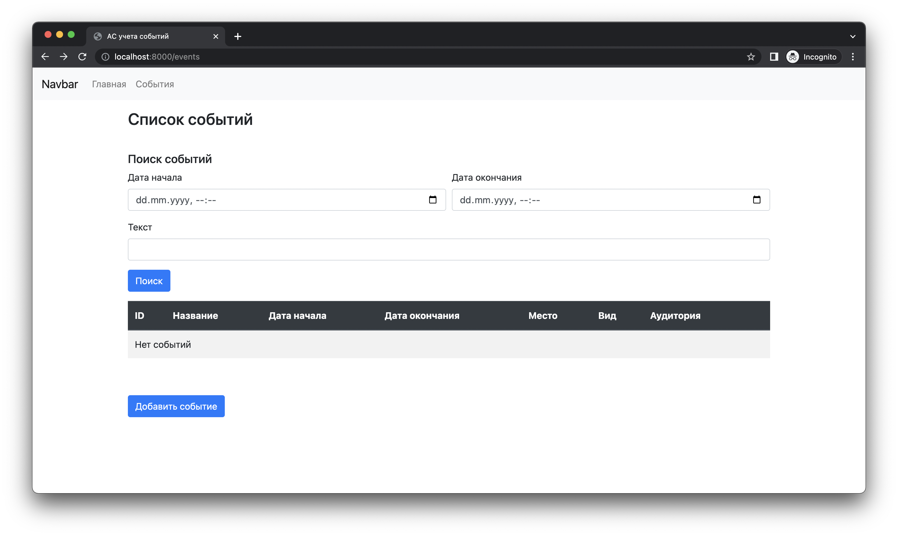

## Создание web-приложения на языке Python с использованием фреймворка Flask

Целью прошлого занятия была модернизация консольного приложения для учета событий и реализация в нем подсистемы хранения данных в СУБД SQLite. Примерный результат работы представлен в листингах ниже.


##### Файл `main.py`

```python
from datetime import datetime
from models.lesson import Lesson, LessonType
from models.unit_event import UnitEvent, UnitEventType
from event_store import EventStore


def find_events(store: EventStore):
    print("Поиск событий")
    print("1. По дате")
    print("2. По содержимому")
    print("3. Назад")
    cmd = input()
    if cmd == "1":
        try:
            begin_date = datetime.strptime(input("Начальная дата и время (гггг-мм-дд чч:мм:сс): "), "%Y-%m-%d %H:%M:%S")
        except ValueError:
            print("Неверный формат даты!\n")
            find_events(store)
            return
        try:
            end_date = datetime.strptime(input("Конечная дата и время (гггг-мм-дд чч:мм:сс): "), "%Y-%m-%d %H:%M:%S")
        except ValueError:
            end_date = None
        for event in store.find_by_date(begin_date, end_date):
            print(f"\n{event}\n")
    elif cmd == "2":
        for event in store.find_by_text(input("Введите запрос: ")):
            print(f"\n{event}\n")
    elif cmd == "3":
        return
    else:
        print("Неверная команда!\n")
        find_events(store)
        return


def show_all_events(store: EventStore):
    print("Вывод событий")
    for event in store.get_all():
        print(f"\n{event}\n")


def delete_event(store: EventStore):
    print("Удаление мероприятия")
    for event in store.get_all():
        print(f"\n{event}\n")
    while True:
        try:
            event_id = int(input("Введите ID мероприятия: "))
        except ValueError:
            print("Некорректный ID")
            continue
        store.remove_event(event_id)
        print("Удалено")
        break


def add_event(store: EventStore):
    print("Добавление события")
    print("1. Учебное занятие")
    print("2. Мероприятие подразделения")
    print("3. Назад")
    cmd = input()
    if cmd == "1":
        title = input("Дисциплина: ")
        while not title:
            print("Название дисциплины не может быть пустым")
            title = input("Дисциплина: ")
        description = input("Содержание: ")
        while not description:
            print("Содержание дисциплины не может быть пустым")
            description = input("Содержание: ")
        print("Вид занятия: ")
        lesson_type = None
        while not lesson_type:
            for (i, _lesson_type) in enumerate(LessonType):
                print(f"{i + 1}. {_lesson_type}")
            try:
                lesson_type = LessonType(int(input()))
            except ValueError:
                print("Введите номер пункта меню!")
                continue
        begin_date = None
        while not begin_date:
            try:
                begin_date = datetime.strptime(input("Дата и время проведения занятия (гггг-мм-дд чч:мм:сс): "),
                                               "%Y-%m-%d %H:%M:%S")
            except ValueError:
                print("Неверный формат даты!\n")
                continue
        classroom = input("Аудитория: ")
        event = Lesson(title=title,
                       description=description,
                       lesson_type=lesson_type,
                       begin_date=begin_date,
                       classroom=classroom)
    elif cmd == "2":
        title = input("Наименование: ")
        while not title:
            print("Наименование мероприятия не может быть пустым")
            title = input("Наименование: ")
        description = input("Содержание: ")
        while not description:
            print("Содержание мероприятия не может быть пустым")
            description = input("Содержание: ")
        print("Вид мероприятия: ")
        unit_event_type = None
        while not unit_event_type:
            for (i, _unit_event_type) in enumerate(UnitEventType):
                print(f"{i + 1}. {_unit_event_type}")
            try:
                unit_event_type = UnitEventType(int(input()))
            except ValueError:
                print("Введите номер пункта меню!")
                continue
        begin_date = None
        while not begin_date:
            try:
                begin_date = datetime.strptime(input("Дата и время начала мероприятия (гггг-мм-дд чч:мм:сс): "),
                                               "%Y-%m-%d %H:%M:%S")
            except ValueError:
                print("Неверный формат даты!\n")
                continue
        end_date = None
        while not end_date:
            try:
                end_date = datetime.strptime(input("Дата и время окончания мероприятия (гггг-мм-дд чч:мм:сс): "),
                                             "%Y-%m-%d %H:%M:%S")
            except ValueError:
                print("Неверный формат даты!\n")
                continue
        event = UnitEvent(title=title,
                          description=description,
                          unit_event_type=unit_event_type,
                          begin_date=begin_date,
                          end_date=end_date)
    elif cmd == "3":
        return
    else:
        print("Неверная команда!\n")
        add_event(store)
        return
    print(f"\n{event}\n")
    print("Сохранить изменения?")
    print("1. Да")
    print("2. Нет")
    while True:
        cmd = input()
        if cmd == "1":
            store.add_event(event)
            print("Изменения сохранены!\n")
            break
        elif cmd == "2":
            print("Изменения отменены!\n")
            break
        else:
            print("Неверная команда!\n")


def main():
    store = EventStore()
    while True:
        print("1. Показать все события")
        print("2. Добавить событие")
        print("3. Поиск")
        print("4. Удалить мероприятие")
        print("5. Выход")
        cmd = input()
        if cmd == "1":
            show_all_events(store)
        elif cmd == "2":
            add_event(store)
        elif cmd == "3":
            find_events(store)
        elif cmd == "4":
            delete_event(store)
        elif cmd == "5":
            break
        else:
            print("Неверная команда!\n")


if __name__ == "__main__":
    main()
```


##### Файл `event_store.py`

```python
from models.event import Event
from models.lesson import Lesson, LessonType
from models.unit_event import UnitEvent, UnitEventType
from models.place import Place
from datetime import datetime
import sqlite3


class EventStore:

    def __init__(self):
        self.__connection = self.__init_database()

    def __init_database(self):
        connection_string = 'database.db'
        connection = sqlite3.connect(connection_string)
        connection.execute("PRAGMA foreign_keys = ON")
        connection.row_factory = sqlite3.Row
        cursor = connection.cursor()
        if not bool(cursor.execute(
                "SELECT name FROM sqlite_master WHERE type='table' AND name='places';").fetchall()):
            cursor.execute("CREATE TABLE places (id INTEGER PRIMARY KEY AUTOINCREMENT, title TEXT NOT NULL)")
            data = {
                (1, "Казарма"),
                (2, "Спортгородок"),
                (3, "Учебный корпус")
            }
            statement = "INSERT INTO places (id, title) VALUES (?, ?)"
            cursor.executemany(statement, data)
            connection.commit()
        if not bool(cursor.execute(
                "SELECT name FROM sqlite_master WHERE type='table' AND name='lesson_types';").fetchall()):
            cursor.execute("CREATE TABLE lesson_types (id INTEGER PRIMARY KEY AUTOINCREMENT, title TEXT NOT NULL)")
            data = {
                (1, "Лекция"),
                (2, "Практическое занятие"),
                (3, "Семинар"),
                (4, "Самостоятельная работа"),
                (5, "Лабораторная работа")
            }
            statement = "INSERT INTO lesson_types (id, title) VALUES (?, ?)"
            cursor.executemany(statement, data)
            connection.commit()
        if not bool(cursor.execute(
                "SELECT name FROM sqlite_master WHERE type='table' AND name='unit_event_types';").fetchall()):
            cursor.execute("CREATE TABLE unit_event_types (id INTEGER PRIMARY KEY AUTOINCREMENT, title TEXT NOT NULL)")
            data = {
                (1, "Чистка оружия"),
                (2, "Спортивно-массовая работа"),
                (3, "Информирование"),
                (4, "Воспитательная работа")
            }
            statement = "INSERT INTO unit_event_types (id, title) VALUES (?, ?)"
            cursor.executemany(statement, data)
            connection.commit()
        if not bool(cursor.execute(
                "SELECT name FROM sqlite_master WHERE type='table' AND name='events';").fetchall()):
            cursor.execute("CREATE TABLE events (id INTEGER PRIMARY KEY AUTOINCREMENT, title TEXT NOT NULL, "
                           "description TEXT, begin_date INTEGER NOT NULL, end_date INTEGER NOT NULL, "
                           "place_id INTEGER NOT NULL, FOREIGN KEY (place_id) REFERENCES places(id))")
        if not bool(cursor.execute(
                "SELECT name FROM sqlite_master WHERE type='table' AND name='lessons';").fetchall()):
            cursor.execute("CREATE TABLE lessons (id INTEGER PRIMARY KEY AUTOINCREMENT, event_id INTEGER NOT NULL, "
                           "lesson_type_id INTEGER NOT NULL, classroom TEXT NOT NULL, "
                           "CONSTRAINT fk_events FOREIGN KEY (event_id) REFERENCES events(id) ON DELETE CASCADE,"
                           "FOREIGN KEY (lesson_type_id) REFERENCES lesson_types(id))")
        if not bool(cursor.execute(
                "SELECT name FROM sqlite_master WHERE type='table' AND name='unit_events';").fetchall()):
            cursor.execute("CREATE TABLE unit_events (id INTEGER PRIMARY KEY AUTOINCREMENT, "
                           "event_id INTEGER NOT NULL, unit_event_type_id INTEGER NOT NULL,"
                           "CONSTRAINT fk_events FOREIGN KEY (event_id) REFERENCES events(id) ON DELETE CASCADE,"
                           "FOREIGN KEY (unit_event_type_id) REFERENCES unit_event_types(id))")
        return connection

    def add_event(self, event: Event):
        assert isinstance(event, Event), "Event is required"
        cursor = self.__connection.cursor()
        cursor.execute("INSERT INTO events (title, description, begin_date, end_date, place_id) "
                       "VALUES (?, ?, ?, ?, ?)",
                       (event.title, event.description, int(event.begin_date.timestamp()),
                        int(event.end_date.timestamp()), event.place.value))
        self.__connection.commit()
        if type(event) == Lesson:
            cursor.execute("INSERT INTO lessons (event_id, lesson_type_id, classroom) VALUES (?, ?, ?)",
                           (cursor.lastrowid, event.lesson_type.value, event.classroom))
        elif type(event) == UnitEvent:
            cursor.execute("INSERT INTO unit_events (event_id, unit_event_type_id) VALUES (?, ?)",
                           (cursor.lastrowid, event.unit_event_type.value))
        self.__connection.commit()

    def remove_event(self, event_id: int):
        assert isinstance(event_id, int), "Event is required"
        cursor = self.__connection.cursor()
        cursor.execute("DELETE FROM events WHERE id=?", (event_id,))
        self.__connection.commit()

    def find_by_date(self, begin_date: datetime, end_date: datetime = None):
        assert type(begin_date) == datetime, "Begin date: datetime required!"
        cursor = self.__connection.cursor()
        if end_date:
            rows = cursor.execute("SELECT events.id, title, description, begin_date, end_date, place_id, "
                                  "lesson_type_id, classroom, unit_event_type_id from events "
                                  "LEFT JOIN lessons ON events.id = lessons.event_id "
                                  "LEFT JOIN unit_events ON events.id = unit_events.event_id "
                                  "WHERE begin_date>=? AND end_date <=?",
                                  (begin_date.timestamp(), end_date.timestamp()))
        else:
            rows = cursor.execute("SELECT events.id, title, description, begin_date, end_date, place_id, "
                                  "lesson_type_id, classroom, unit_event_type_id from events "
                                  "LEFT JOIN lessons ON events.id = lessons.event_id "
                                  "LEFT JOIN unit_events ON events.id = unit_events.event_id "
                                  "WHERE begin_date>=?", (begin_date.timestamp(),))
        return self.__convert_rows_to_objects(rows)

    def find_by_text(self, text: str):
        assert type(text) == str, "text: str required!"
        cursor = self.__connection.cursor()
        rows = cursor.execute("SELECT events.id, title, description, begin_date, end_date, place_id, "
                              "lesson_type_id, classroom, unit_event_type_id from events "
                              "LEFT JOIN lessons ON events.id = lessons.event_id "
                              "LEFT JOIN unit_events ON events.id = unit_events.event_id "
                              f"WHERE title LIKE '%{text}%'")
        return self.__convert_rows_to_objects(rows)

    def get_all(self):
        cursor = self.__connection.cursor()
        rows = cursor.execute("SELECT events.id, title, description, begin_date, end_date, place_id, "
                              "lesson_type_id, classroom, unit_event_type_id from events "
                              "LEFT JOIN lessons ON events.id = lessons.event_id "
                              "LEFT JOIN unit_events ON events.id = unit_events.event_id")
        return self.__convert_rows_to_objects(rows)

    def __convert_rows_to_objects(self, rows):
        for row in rows:
            if row["lesson_type_id"]:
                yield Lesson(lesson_id=row["id"], title=row["title"], description=row["description"],
                             lesson_type=LessonType(row["lesson_type_id"]),
                             begin_date=datetime.fromtimestamp(row["begin_date"]))
            elif row["unit_event_type_id"]:
                yield UnitEvent(unit_event_id=row["id"], title=row["title"], description=row["description"],
                                unit_event_type=UnitEventType(row["unit_event_type_id"]),
                                begin_date=datetime.fromtimestamp(row["begin_date"]),
                                end_date=datetime.fromtimestamp(row["end_date"]))
            else:
                yield Event(event_id=row["id"], title=row["title"], description=row["description"],
                            begin_date=datetime.fromtimestamp(row["begin_date"]),
                            end_date=datetime.fromtimestamp(row["end_date"]), place=Place(row["place_id"]))
```


##### Файл `event.py`

```python
from datetime import datetime
from models.place import Place


class Event:

    def __init__(self, title, description, begin_date, end_date, place, event_id=None):
        assert isinstance(begin_date, datetime), "Begin date: datetime class is required"
        assert isinstance(end_date, datetime), "End date: datetime class is required"
        assert isinstance(place, Place), "Place: Place class is required"
        self.__id = event_id
        self.__title = title
        self.__description = description
        self.__begin_date = begin_date
        self.__end_date = end_date
        self.__place = place

    @property
    def id(self):
        return self.__id

    @property
    def title(self):
        return self.__title

    @property
    def description(self):
        return self.__description

    @property
    def begin_date(self):
        return self.__begin_date

    @property
    def end_date(self):
        return self.__end_date

    @property
    def place(self):
        return self.__place

    @place.setter
    def place(self, value):
        assert isinstance(value, Place), "Place: Place class is required"
        self.__place = value

    def __str__(self):
        return f"Событие {self.__id if self.__id else '(без идентификатора)'}\n" \
               f"Название:\t{self.title}\n" \
               f"Описание:\t{self.description}\n" \
               f"Начало:\t\t{str(self.begin_date)}\n" \
               f"Окончание:\t{str(self.end_date)}"

    def __eq__(self, event) -> bool:
        assert isinstance(event, Event), "Event is required"
        return type(self) == type(event) and self.id == event.id

    def __iter__(self):
        for key in ["class", "id", "title", "description", "begin_date", "end_date", "place_id"]:
            if key in ["id", "begin_date", "end_date"]:
                yield key, str(getattr(self, key))
            elif key == "place_id":
                yield key, self.__place.value
            elif key == "class":
                yield key, str(self.__class__.__name__)
            else:
                yield key, getattr(self, key)
```


##### Файл `lesson.py`

```python
from datetime import timedelta
from enum import Enum
from models.event import Event
from models.place import Place


class Lesson(Event):

    def __init__(self, title, description, lesson_type, begin_date, classroom=None, lesson_id=None):
        super().__init__(title, description, begin_date, begin_date + timedelta(minutes=90), Place.CAMPUS, lesson_id)
        assert isinstance(lesson_type, LessonType), "Lesson type: LessonType class is required!"
        self.__lesson_type = lesson_type
        self.__classroom = classroom
        self.__id = lesson_id
        
    @property
    def lesson_type(self):
        return self.__lesson_type
    
    @property
    def classroom(self):
        return self.__classroom or "Не назначена"
        
    def __str__(self):
        return f"Занятие {self.__id if self.__id else '(без идентификатора)'}\n" \
                f"Дисциплина:\t{self.title}\n" \
                f"Содержание:\t{self.description}\n" \
                f"Вид занятия:\t{self.__lesson_type}\n" \
                f"Начало:\t\t{str(self.begin_date)}\n" \
                f"Окончание:\t{str(self.end_date)}\n" \
                f"Место:\t\t{self.place}\n" \
                f"Аудитория:\t{self.classroom}"

    def __iter__(self):
        for key in ["class", "id", "title", "description", "lesson_type_id", "begin_date", "end_date", "place_id", "classroom"]:
            if key in ["id", "begin_date", "end_date"]:
                yield key, str(getattr(self, key))
            elif key in ["place_id", "lesson_type_id"]:
                yield key, getattr(self, key[:-3]).value
            elif key == "class": 
                yield key, str(self.__class__.__name__)
            else:
                yield key, getattr(self, key)


class LessonType(Enum):

    LECTURE = 1
    PRACTICAL = 2
    SEMINAR = 3
    SELF_WORK = 4
    LABORATORY_WORK = 5

    def __str__(self) -> str:
        if self.value == 1:
            return "Лекция"
        elif self.value == 2:
            return "Практическое занятие"
        elif self.value == 3: 
            return "Семинар"
        elif self.value == 4:
            return "Самостоятельная работа"
        elif self.value == 5:
            return "Лабораторная работа"
```


##### Файл `unit_event.py`

```python
from enum import Enum
from models.event import Event
from models.place import Place


class UnitEvent(Event):
    
    def __init__(self, title, description, unit_event_type, begin_date, end_date, unit_event_id=None):
        assert isinstance(unit_event_type, UnitEventType), "Unit event type: UnitEventType class is required!"
        if unit_event_type == UnitEventType.SPORTS:
            place = Place.SPORTS_GROUND
        else:
            place = Place.BARRACKS
        super().__init__(title, description, begin_date, end_date, place, unit_event_id)
        self.__unit_event_type = unit_event_type
        self.__id = unit_event_id

    @property
    def unit_event_type(self):
        return self.__unit_event_type

    def __str__(self):
        return f"Мероприятие {self.__id if self.__id else '(без идентификатора)'}\n" \
                f"Наименование:\t{self.title}\n" \
                f"Содержание:\t{self.description}\n" \
                f"Вид:\t\t{self.__unit_event_type}\n" \
                f"Начало:\t\t{str(self.begin_date)}\n" \
                f"Окончание:\t{str(self.end_date)}\n" \
                f"Место:\t\t{self.place}"

    def __iter__(self):
        for key in ["class", "id", "title", "description", "unit_event_type_id", "begin_date", "end_date", "place_id"]:
            if key in ["id", "begin_date", "end_date"]:
                yield key, str(getattr(self, key))
            elif key in ["place_id", "unit_event_type_id"]:
                yield key, getattr(self, key[:-3]).value
            elif key == "class": 
                yield key, str(self.__class__.__name__)
            else:
                yield key, getattr(self, key)


class UnitEventType(Enum):

    WEAPON_CLEANING = 1
    SPORTS = 2
    INFORMING = 3
    UPBRINGING = 4

    def __str__(self) -> str:
        if self.value == 1:
            return "Чистка оружия"
        elif self.value == 2:
            return "Спортивно-массовая работа"
        elif self.value == 3: 
            return "Информирование"
        elif self.value == 4:
            return "Воспитательная работа"
```


##### Файл `place.py`

```python
from enum import Enum


class Place(Enum):

    BARRACKS = 1
    SPORTS_GROUND = 2
    CAMPUS = 3

    def __str__(self) -> str:
        if self.value == 1:
            return "Казарма"
        elif self.value == 2:
            return "Спортгородок"
        elif self.value == 3:
            return "Учебный корпус"
```


Однако очевидно, что консольный интерфейс не является удобным для взаимодействия пользователей с ним. 

В рамках сегодняшнего занятия необходимо разработать web-приложение с использованием фреймворка Flask для учета событий. Приложение должно иметь веб-интерфейс, а также все функциональные возможности, которые были реализованы ранее. Для этого существующая подсистема хранения данных останется без изменений.


### Задача

1. Разработать web-приложение с использованием фреймворка Flask для учета событий с использованием существующей подсистемы хранения данных.


### Порядок выполнения

Для начала необходимо установить фреймворк флас в рамках виртуального окружения с помощью менеджера пакетов `pip`. При наличии подключения к интернету достаточно выполнить команду `pip install flask`.  Если подключение к интернету отсутсвует, то можно установить `flask` , используя заранее скачанную копию. В каталоге `lib` таковая имеется, вместе с необходимыми зависимостями. Для установки необходимо выполнить команду `pip install flask --no-index --find-links lib`.


#### Создание главного файла приложения

В основном каталоге проекта необходимо создать файл нашего  web-приложения. Назовем его `app.py`. Для начала напишем простейшее приложение flask.


```python
from flask import Flask


app = Flask(__name__)


@app.route("/")
def index():
    return "Hello, world"


if __name__ == "__main__":
    app.run("0.0.0.0", 8000)
```


Теперь, если запустить приложение и в браузере открыть страницу http://localhost:8000, то в результате на странице отобразиться строка Hello, world.

Тут инициализируется экземпляр приложения `app = Flask(__name__)`. Затем над функцией, которая возвращает пользователю строку, ставится декоратор `@app.route("/")`. Здесь `app` - экземпляр приложения, а `route`  обозначает маршрут, по которому будет вызвана эта функция. Фнкуция `route` принимет дополнительные параметры, кроме адреса маршрута. Подробнее об этом можно прочитать в документации. Однако нас интересует один параметр `methods` , который принимает список строк с названиями методов протокола HTTP. С помощью переданного массива можно указать, каким HTTP методом следует обращаться к данному эндпоинту. Без указания параметра `methods`  по умолчанию ожидается метод GET, т.е. `@app.route("/")` и `@app.route("/", methods=['GET']) ` являются эквивалентными. А декоратор `@app.route("/", methods=['GET', 'POST'])`  показывает, что ожидается доступ посредством методов GET или POST. 

#### Разбор архитектуры web-приложения

Как правило, при разработке web-приложений создается очень много эндпоинтов (точек входа, т.е. фактически url- адресов, на которые будет отвечать приложение), которые фактически являются обычными функциями. Поэтому держать их все в одном файле, в нашем случае `app.py`, нецелесообразно. Классическим подходом в разработке web-приложений является применение шаблона проектирования MVC (Model-View-Controller), о котором рассказывалось на лекции. Рассмотрим существующее приложение применительно к MVC. Так, у нас есть модели данных и интерфейс доступа к базе данных, что в целом представляет слой моделей. Слой представления сейчас реализован в файле `main.py` и представляет из себя консольный интерфейс. Соответсвенно данный слой должен быть преобразован в веб-интерфейс. Для этого Flask использует шаблонизатор Jinja. И, наконец, всю логику приложения, которая сейчас также реализована в `main.py`, необходимо перенести в слой контроллеров.


#### Создание контроллеров

Создадим в корне проекта каталок `controllers`.  В нем создадим файл контроллера `event_controller.py`. Начальное содержимое файла `event_controller.py` представлено в листинге ниже.


```python
from flask import Blueprint, request


events = Blueprint("events", __name__)
route = "/events"


@events.route(route, methods=["GET"])
def get_all_events():
    return "Hello, world, from event controller"
```


Тут имеются некоторые отличия от функции `index` из файла `app.py`.  Во первых, декоратор `@events.get`.  В этом файле нет экземпляра Flask, и выполнить импорт `import app from app` невозможно, потому что это влечет за собой циклические импорты (т.е. Файл `app.py`  будет импортировать `event_controller.py`  и наоборот). Поэтому был придуман механизм так называемых "блюпринтов". Так, с помощью экземпляра класса `Blueprint` можно аналогичным образом устанавливать декораторы для функций. А чтобы приложение увидело созданный блюпринт, его необходимо зарегистрировать. Для этого необходимо внести следующие изменения в файл `app.py`:


```python
from flask import Flask
from controllers.event_controller import events


app = Flask(__name__)
app.register_blueprint(events)


@app.route("/")
def index():
    return "Hello, world"


if __name__ == "__main__":
    app.run("0.0.0.0", 8000)
```


Теперь при запуске приложения, если обратиться по адресу http://localhost:8000, браузер отобразит строку "Hello, world", а если обратиться по адресу http://localhost:8000/events,  то браузер отобразит строку "Hello, world, from event controller". Значит, контроллер работает корректно.

Поскольку в файле `event_controller.py`  мы создали функцию `get_all_events`, очевидно, она должна возвращать все события из базы данных. Интерфейс доступа к базе данных у нас имеется, поэтому можно воспользоваться существующими функциями.


> ##### Замечание
>
> Сейчас в качестве СУБД используется SQLite, чтобы в учебных целях не тратить время на установку и настройку более крупных СУБД. Однако за счет из-за своей прототы SQLite не поддерживает ряд функций, свойственных промышленным системам. Так, SQLite не поддерживает многопользовательский доступ и имеет ограничения при подключении из многопоточного приложения. Для того, чтобы исключить ошибки, необходимо внести изменения в файл `event_store`, а именно заменить строку подключения `connection = sqlite3.connect(connection_string)` на `connection = sqlite3.connect(connection_string, check_same_thread=False)`. В реальных проектах так делать не следует, поскольку так целостность и согласованность данных могут быть нарушены, а следует использовать более крупные СУБД, например Postgres, MySQL, Oracle и пр. 


```python
from flask import Blueprint, request
from event_store import EventStore

events = Blueprint("events", __name__)
route = "/events"


store = EventStore()


@events.route(route, methods=["GET"])
def get_all_events():
    return {
        "events": [event for event in store.get_all()]
    }
```


Теперь при обращении к прилодению по адресу http://localhost:8000/events в браузере будет отображен текст в формате `json`, содержащий все события из базы данных. 

Далее определим в данном контроллере иные необходимые функции для работы с событиями и на данном этапе перейдем к разработке представлений.


```python
from flask import Blueprint, request
from event_store import EventStore

events = Blueprint("events", __name__)
route = "/events"


store = EventStore()


@events.route(route, methods=["GET"])
def get_all_events():
    return {
        "events": [event for event in store.get_all()]
    }


@events.route(f"{route}/search", methods=["GET"])
def find_events():
    pass


@events.route(f"{route}/add", methods=["GET", "POST"])
def add_event():
    pass


@events.route(f"{route}/delete", methods=["POST"])
def delete_event():
    pass
```


#### Создание представлений

Очевидно, что пользователю неудобно работать с форматом `json`. Пожтому необходимо сделать представления - HTML-страницы - для адекватного представления данных. Для начала разработаем главную страницу приложения. Создадим каталог `templates` в корне проекта. Там создадим файл `index.html` со следующим содержимым:


```html
<!doctype html>
<html>
<head>
    <meta charset="UTF-8">
    <meta name="viewport"
          content="width=device-width, user-scalable=no, initial-scale=1.0, maximum-scale=1.0, minimum-scale=1.0">
    <meta http-equiv="X-UA-Compatible" content="ie=edge">
    <title>АС учета событий</title>
    <link rel="stylesheet" href="{{ url_for('static', filename='css/bootstrap.min.css') }}">
    <script src="{{ url_for('static', filename='js/jquery-3.6.0.min.js') }}"></script>
    <script src="{{ url_for('static', filename='js/bootstrap.min.js') }}"></script>
</head>
<body>
    <nav class="navbar navbar-expand-lg navbar-light bg-light">
        <a class="navbar-brand" href="#">Navbar</a>
        <button class="navbar-toggler"
                type="button"
                data-toggle="collapse"
                data-target="#mainMenu"
                aria-controls="mainMenu"
                aria-expanded="false"
                aria-label="Toggle navigation">
            <span class="navbar-toggler-icon"></span>
        </button>
        <div class="collapse navbar-collapse" id="mainMenu">
            <ul class="navbar-nav">
                <li class="navbar-item">
                    <a class="nav-link" href="/">Главная</a>
                </li>
                <li class="navbar-item">
                    <a class="nav-link" href="/events">События</a>
                </li>
            </ul>
        </div>
    </nav>
    <div class="container">
      <h1>Главная страница</h1>
    </div>
</body>
</html>
```


Следует обратить внимание, что страница сверстана с использованием библиотеки Bootstrap. Файлы библиотеки, а также дополнительные файлы стилей и скриптов должны находится в каталоге `static`. Кроме того, подключать данные файлы необходимо с помощью функции `url_for`, как показано выше.

Также необходимо изменить функцию `index`  в файле `app.py`. Теперь она будет возвращать не строку, а шаблон страницы из файла `index.html`. Для этого необходимо использовать функцию `render_template`.


```python
from flask import Flask, render_template
from controllers.event_controller import events


app = Flask(__name__)
app.register_blueprint(events)


@app.route("/")
def index():
    return render_template("index.html")


if __name__ == "__main__":
    app.run("0.0.0.0", 8000)
```


Сейчас при переходе по адресу http://localhost:8000. браузер покажет содержимое страницы `index.html`, т.е. меню и пустую страницу. При нажатии на кнопку "События" браузер отобразит список всех событий в формате `json`. Поскольку кнопка события является ссылкой на маршрут `/events`, то наше приложение обращается к контроллеру `event_controller` и выполняет там функцию `get_all_events`.

Прежде чем перейти к реализации других веб-страниц, следует проанализировать страницу `index.html`. Наше приложение, скорее всего, будет выполнено в одном стиле, т.е. с использованием библиотеки Bootstrap. Кроме того, главное меню, которое мы реализовали выше, должно быть доступно по всему приложению. Значит, что содержимое секции `<head>...</head>` , а также секии `<nav>...</nav>` с главным меню, будет одинаковым для всех страниц. Вместе с тем содержимое секции `<div class=container>...</div>`  будет отличатся. 

Для таких случаев Flask пердлагает механизм наследования шаблонов. Работает он следующим образом. Создадим файл `base.html` в каталоге `templates` и скопируем в него содержимое `index.html`, кроме секции `<div class="container"></div>`.


```python
<!doctype html>
<html>
<head>
    <meta charset="UTF-8">
    <meta name="viewport"
          content="width=device-width, user-scalable=no, initial-scale=1.0, maximum-scale=1.0, minimum-scale=1.0">
    <meta http-equiv="X-UA-Compatible" content="ie=edge">
    <title>АС учета событий</title>
    <link rel="stylesheet" href="{{ url_for('static', filename='css/bootstrap.min.css') }}">
    <script src="{{ url_for('static', filename='js/jquery-3.6.0.min.js') }}"></script>
    <script src="{{ url_for('static', filename='js/bootstrap.min.js') }}"></script>
</head>
<body>
    <nav class="navbar navbar-expand-lg navbar-light bg-light">
        <a class="navbar-brand" href="#">Navbar</a>
        <button class="navbar-toggler"
                type="button"
                data-toggle="collapse"
                data-target="#mainMenu"
                aria-controls="mainMenu"
                aria-expanded="false"
                aria-label="Toggle navigation">
            <span class="navbar-toggler-icon"></span>
        </button>
        <div class="collapse navbar-collapse" id="mainMenu">
            <ul class="navbar-nav">
                <li class="navbar-item">
                    <a class="nav-link" href="/">Главная</a>
                </li>
                <li class="navbar-item">
                    <a class="nav-link" href="/events">События</a>
                </li>
            </ul>
        </div>
    </nav>
    <div class="container">
        
    </div>
</body>
</html>
```


В данном случае блок `<div class="container"></div>`  содержит строку ``.  Это означает, что шаблонизатор Jinja готов подставить в это место блок с названием `content`. Давайте создадим его. Для этого изменим файл `index.html`:


```html



    <h1>Главная страница</h1>

```


Здесь мы указали шаблонизатора, что в качестве основного шаблона мы хотим использовать `base.html`, и дополнительно определяем блок `content`.  Таким образом, при обращении по адресу http://localhost:8000 шаблонизатор генерирует корректную страницу с меню и заголовком "Главная страница".

Аналогичным образом создадим страницу для событий - файл `events.html` в каталоге `templates`.


```html



    <div class="row">
        <div class="col-12 my-3">
            <h3>Список событий</h3>
        </div>
        <div class="col-12 my-3">
            <h5>Поиск событий</h5>
            <form action="/events/search" method="get">
                <div class="form-row">
                    <div class="form-group col-md-6">
                        <label for="beginDate">Дата начала</label>
                        <input type="datetime-local" 
                               class="form-control" id="beginDate" name="begin_date">
                    </div>
                    <div class="form-group col-md-6">
                        <label for="endDate">Дата окончания</label>
                        <input type="datetime-local" 
                               class="form-control" id="endDate" name="end_date">
                    </div>
                </div>
                <div class="form-row">
                    <div class="form-group col-12">
                        <label for="query">Текст</label>
                        <input type="text" class="form-control" id="query" name="query">
                    </div>
                </div>
                <button type="submit" class="btn btn-primary">Поиск</button>
            </form>
        </div>
        <div class="col-12">
            <table class="table table-striped table-hover">
                <thead class="thead-dark">
                    <tr>
                        <th>ID</th>
                        <th>Название</th>
                        <th>Дата начала</th>
                        <th>Дата окончания</th>
                        <th>Место</th>
                        <th>Вид</th>
                        <th>Аудитория</th>
                        <th></th>
                    </tr>
                </thead>
                <tbody>
                    
                    <tr>
                        <td colspan="8">Нет событий</td>
                    </tr>
                    
                    
                    <tr>
                        <td class="align-middle">{{ event.id }}</td>
                        <td class="align-middle">{{ event.title }}</td>
                        <td class="align-middle">{{ event.begin_date }}</td>
                        <td class="align-middle">{{ event.end_date }}</td>
                        <td class="align-middle">{{ event.place }}</td>
                        <td class="align-middle">
                          {{ event.lesson_type or event.unit_event_type }}</td>
                        <td class="align-middle">{{ event.classroom }}</td>
                        <td class="align-middle">
                            <form action="/events/delete" method="post">
                                <input type="hidden" name="id" value="{{ event.id }}" />
                                <button type="submit" 
                                        class="btn btn-danger">Удалить</button>
                            </form>
                        </td>
                    </tr>
                    
                    
                </tbody>
            </table>
        </div>
        <div class="col-12 my-5">
            <a href="/events/add" class="btn btn-primary">Добавить событие</a>
        </div>
    </div>

```


В коде шаблона видно, что есть некий массив `events`, из елементов которого формируюется страница. Если длина массива равна 0 ``, тогда отрисовывается одна строка с текстом "Нет событий", иначе события отображаются в таблице. В каждой строке таблицы имеется форма с единственным значением `id`  и кнопкой типа `submit` для отправки формы. При нажатии на эту кнопку формируется POST запрос со значением `id` события и отправится по маршруту `/events/delete` для удаления. Ранее мы определили этот маршрут в контроллере, но не реализовали его. Кроме того, на странице имеется кнопка-ссылка на страницу `/events/add`. В контроллере также определен и не реализован данный маршрут, при этом он работает для GET и POST запросов одновременно. Наконец, в на странице реализована форма поиска оп датам и текстовому запросу, которая отправляет GET-запрос по маршруту `/events/search`. Данный маршрут также необходимо реализовать в контроллере.

Как известно, GET запросы используют для получения данных, а POST - для их изменения. Придерживаясь такого подхода, при обращении по маршруту `/events/add` методом GET будем возвращать страницу с формой для добавления нового события, а при POST запросе - создавать событие. Создадим представление с формой для добавления нового события - файл `new_event.html`  в каталоге `templates`.


```html



    <div class="row">
        <div class="col-12 my-3">
            <h3>Добавить новое событие</h3>
        </div>
        <div class="col-12">
            
            <div class="alert alert-danger alert-dismissible mb-3">{{ error }}</div>
            
            <form action="/events/add" method="post">
                <div class="form-group">
                    <label for="eventTypeSelect">Вид события</label>
                    <select class="form-control form-control-lg" 
                            id="eventTypeSelect" name="event_type">
                        <option value="lesson">Учебное занятие</option>
                        <option value="unit_event">Мероприятие подразделения</option>
                    </select>
                </div>
                <div id="formGroup">

                </div>
                <template id="lessonFormGroup">
                    <div class="form-group">
                        <label for="title">Название дисциплины</label>
                        <input type="text" name="title" class="form-control" id="title">
                    </div>
                    <div class="form-group">
                        <label for="description">Описание дисциплины</label>
                        <input type="text" name="description" 
                               class="form-control" id="description">
                    </div>
                    <div class="form-group">
                        <label for="lessonType">Вид занятия</label>
                        <select class="form-control form-control-lg" 
                                id="lessonType" name="lesson_type">
                            <option value="lecture">Лекция</option>
                            <option value="practical">Практическое занятие</option>
                            <option value="seminar">Семинар</option>
                            <option value="self_work">Самостоятельная работа</option>
                            <option value="laboratory_work">Лабораторная работа</option>
                        </select>
                    </div>
                    <div class="form-group">
                        <label for="beginDate">Дата начала</label>
                        <input type="datetime-local" name="begin_date" 
                               class="form-control" id="beginDate">
                    </div>
                    <div class="form-group">
                        <label for="classroom">Аудитория</label>
                        <input type="text" name="classroom" 
                               class="form-control" id="classroom">
                    </div>
                </template>
                <template id="unitEventFormGroup" class="mt-5">
                    
                </template>
                <button type="submit" class="btn btn-primary">Сохранить</button>
            </form>
        </div>
    </div>
    <script src="{{ url_for('static', filename='js/new-event-script.js') }}"></script>

```


> HTML-элемент шаблона контента **`<template>`** — это механизм для отложенного создания клиентского контента, который не отображается во время загрузки страницы, но может быть инициализирован при помощи JavaScript.
>
> Шаблон можно представить себе как фрагмент контента страницы, сохранённый для последующего использования в документе. Хотя парсер и обрабатывает содержимое элемента **`<template>`** во время загрузки страницы, он делает это, только чтобы убедиться в валидности содержимого, само содержимое при этом не отображается. [Источник](https://developer.mozilla.org/ru/docs/Web/HTML/Element/template)


Поскольку форма необходима динамическая, чтобы отображать поля в зависимости от выбранного типа мероприятия, то необходимо также добавить js-скрипт для манипулирования DOM элементами страницы. Создадим файл `new-event-script.js`  со следующим содержимым:


```js
const lessonFormGroup = document.querySelector("#lessonFormGroup");
const unitEventFormGroup = document.querySelector("#unitEventFormGroup");
const formGroup = document.querySelector("#formGroup");

const eventTypeSelect = document.querySelector("#eventTypeSelect");

function onEventTypeSelected() {
    changeEventType(eventTypeSelect.value);
}

function changeEventType(type) {
    while (formGroup.lastElementChild) {
        formGroup.removeChild(formGroup.lastElementChild);
    }
    if (type === "lesson") {
        formGroup.append(lessonFormGroup.content.cloneNode(true));
    } else {
        formGroup.append(unitEventFormGroup.content.cloneNode(true));
    }
}

eventTypeSelect.addEventListener("change", onEventTypeSelected);

(() => {
    changeEventType(eventTypeSelect.value);
})();
```


Таким образом была создана форма для создания нового пользователя. Форма отправляет данные POST запросом по маршруту `/events/add`.  Кроме того, форма может вывести ошибку, если контроллер передаст ей значение `error`.


> #### Задание
>
> - [ ] В файле `new_event.html` реализовать форму добавления мероприятия подразделения внутри секции `<template id="unitEventFormGroup" class="mt-5"></template>` по аналогии с добавлением учебного занятия
> - [ ] В файле `events.html`  предусмотреть вывод ошибок, а также информационных сообщений (см. скриншоты) по аналогии с файлом `new_event.html` .


#### Доработка контроллеров


Вернемся к контроллеру `event_controller.py`.  Необходимо его изменить таким образом, чтобы метод `add_event` при GET запросе выдавал только что созданную страницу `new_event.html`,  а при POST запросе считывал полученные данные, создавал новое событие и перенаправлял бы на список событий (на страницу `/events`). Кроме того, в случае некорректных входных данных пользователю должна быть показана ошибка, т.е. необходимо вернуть пользователя на страницу `/events/add` и передать туда значение `error`.  Таким образом, контроллер `event_controller.py` будет выглядеть следующим образом: 


```python
from flask import Blueprint, request, render_template, url_for, redirect
from event_store import EventStore
from datetime import datetime
from models.lesson import Lesson, LessonType
from models.unit_event import UnitEvent, UnitEventType

events = Blueprint("events", __name__)
route = "/events"


store = EventStore()


@events.route(route, methods=["GET"])
def get_all_events():
    return render_template("events.html", events=[event for event in store.get_all()])


@events.route(f"{route}/search", methods=["GET"])
def find_events():
    pass


@events.route(f"{route}/add", methods=["GET", "POST"])
def add_event():
    if request.method == "GET":
        return render_template("new_event.html")
    else:
        if "event_type" not in request.form:
            return render_template("new_event.html", error="Не указан тип мероприятия!")
        event_type = request.form["event_type"]
        if event_type == "lesson":
            # TODO считать по аналогии с request.form["event_type"] параметры и передать их в конструктор Lesson
            event = Lesson(title=title,
                           description=description,
                           lesson_type=lesson_type,
                           begin_date=begin_date,
                           classroom=classroom)
        elif event_type == "unit_event":
            # TODO считать по аналогии с request.form["event_type"] параметры и передать их в конструктор UnitEvent
            event = UnitEvent(title=title,
                              description=description,
                              unit_event_type=unit_event_type,
                              begin_date=begin_date,
                              end_date=end_date)
        else:
            return render_template("new_event.html", 
                                   error="Указан неверный тип мероприятия!")
        store.add_event(event)
        return redirect(url_for(".get_all_events", event_added=True))


@events.route(f"{route}/delete", methods=["POST"])
def delete_event():
    pass
```


> #### Задание
>
> - [ ] Реализовать в контроллере `event_controller` добавление в базу данных учебного занятия.
> - [ ] Реализовать в контроллере `event_controller` добавление в базу данных мероприятия подразделения.


Аналогичным образом необходимо реализовать поиск по тексту и поиск по датам. Поля для ввода дат и текста уже реализованы на странице `events.html`. Также необходимо реализовать удаление данных. При удалении на сторону сервера по маршруту `/events/delete` методом POST должен быть отправлен идентификатор мероприятия, а после удаления пользователь вновь должен увидеть список мероприятий.

При реализации поиска необходимо обратить внимание на то, что функции поиска в подсистеме хранения данных (класс `EventStore`) по датам `find_by_date` и по тексту `find_by_text`  работают независимо друг от друга. А форма отправки поискового запроса позволяет отправлять и даты, и текст одновременно. Таким образом, неоходимо придумать такую функцию `find_by_date_or_text` класса `EventStore`,  которая бы искала по одному, двум или трем указанным параметрам, или возвращала бы все события, если ни один из этих параметров не указан.


```python
def find_by_date_or_text(self, text: str = None, 
                         begin_date: datetime = None, 
                         end_date: datetime = None):
    pass
```


> #### Задание
>
> - [ ] Реализовать в контроллере `event_controller` поиск по датам и тексту.
> - [ ] Реализовать в контроллере `event_controller` удаление мероприятий.
> - [ ] Реализовать в классе `EventStore`  поиска `find_by_date_or_text`.


### Примерный результат работы

#####  

##### Пустой список событий




##### Добавление учебного занятия


##### Список событий с добавленным занятием


##### Добавление мероприятия подразделения


##### Список событий с учебными занятиями и мероприятием подразделения


##### Поиск по ключевому слову


##### Удаление события


